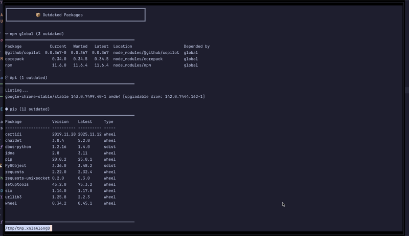

# tmux-outdated-packages

A tmux plugin that displays outdated global packages from common package managers in your status line.




_Screenshots using [Catppuccin](https://github.com/catppuccin/catppuccin) theme. See [github.com/djensenius/dotfiles](https://github.com/djensenius/dotfiles) for configuration examples._

## Features

- Shows outdated package counts for:
  - 🍺 Homebrew (`brew`)
  - 󰎙 npm global packages (`npm -g`)
  -  pip/pip3
  -  Ruby gems
  -  Rust cargo packages (requires `cargo-install-update`)
  -  PHP Composer global packages
  -  Go packages (requires `go-global-update`)
  -  APT packages (Debian/Ubuntu)
  -  DNF packages (Fedora/RHEL)
- Only displays when outdated packages are present
- Uses nerdfonts icons for a clean look
- Integrates with Catppuccin theme

## Installation

### Using TPM (Tmux Plugin Manager)

Add this to your `tmux.conf`:

```tmux
set -g @plugin 'djensenius/tmux-outdated-packages'

# Optional: Configure poll interval (default is 300 seconds / 5 minutes)
set -g @outdated_poll_interval 300
```

Then press `prefix + I` to install.

### Manual Installation

```bash
git clone https://github.com/djensenius/tmux-outdated-packages ~/.tmux/plugins/tmux-outdated-packages
```

Add to your `tmux.conf`:

```tmux
run-shell ~/.tmux/plugins/tmux-outdated-packages/outdated-packages.tmux
```

## How It Works

The plugin uses a background polling architecture for efficiency:

1. **Background Poller**: A daemon process (`poller.sh`) runs in the background, checking package managers every 5 minutes (configurable)
2. **Parallel Checks**: All package managers are checked simultaneously in parallel threads
3. **Smart Caching**: Results are cached and only re-checked when:
   - Package directories change (detected via mtime)
   - The poll interval expires
4. **Instant Display**: The status bar script just reads cached results, so it's lightning fast

This means your status bar updates instantly without blocking tmux, and checks only run when needed.

## Configuration

Set environment variable before starting tmux:

```bash
export TMUX_OUTDATED_POLL_INTERVAL=300  # Poll every 5 minutes (default)
export TMUX_OUTDATED_DEBUG=1           # Enable debug logging
```

Or set in your tmux.conf (requires tmux restart):

```tmux
set-environment -g TMUX_OUTDATED_POLL_INTERVAL 600  # Poll every 10 minutes
set-environment -g TMUX_OUTDATED_DEBUG 1            # Enable debug logging
```

### Debug Mode

Enable debug logging to troubleshoot issues:

```bash
# Enable debug mode
export TMUX_OUTDATED_DEBUG=1

# Restart tmux or reload config
tmux source-file ~/.tmux.conf

# View logs
tail -f $TMPDIR/tmux-outdated-packages/poller.log
```

The log shows:
- When each package manager is checked
- How long each check takes
- Why checks are skipped (no changes, not installed, etc.)
- Directory mtime changes that trigger re-checks

## Usage

### Status Bar

The plugin automatically adds outdated package counts to your status bar.

**Without Catppuccin theme:**

Add to your `.tmux.conf`:
```tmux
set -ag status-right "#{@outdated_packages}"
```

Or with custom colors:
```tmux
set -ag status-right "#[fg=yellow]#{@outdated_packages}#[default]"
```

**With Catppuccin theme:**

Add to your `.tmux.conf`:
```tmux
set -ag status-right "#{E:@catppuccin_status_outdated_packages}"
```

The plugin works with any tmux theme or configuration!

### Interactive Popup

View detailed list of outdated packages:
- **Mouse**: Click on the status bar (right side)
- **Keyboard**: `prefix + u`

The popup shows:
- Full list of outdated packages per manager
- Loading indicator while checking

## Requirements

- tmux 2.1 or higher
- Nerdfonts for proper icon display
- Package managers you want to check (brew, npm, pip3, gem, cargo)

## Notes

- For cargo support, install `cargo-install-update`: `cargo install cargo-update`
- For Go support, install `go-global-update`
- The background poller automatically starts when tmux loads the plugin
- Cache is stored in `$TMPDIR/tmux-outdated-packages` (usually `/tmp`)
- Only one poller instance runs at a time (managed via PID file)
- Checks are skipped if package directories haven't changed (smart mtime detection)
- To manually trigger a check, remove the cache: `rm -rf $TMPDIR/tmux-outdated-packages`
- To stop the poller: `pkill -f tmux-outdated-packages/scripts/poller.sh`
- Debug logs are written to `$TMPDIR/tmux-outdated-packages/poller.log` when `TMUX_OUTDATED_DEBUG=1`

## License

MIT
